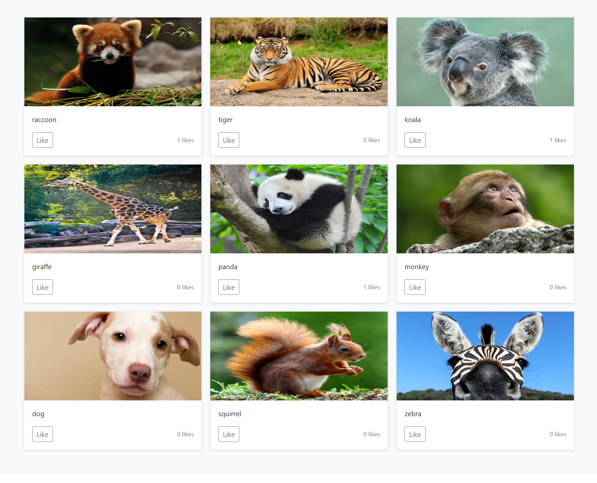

 

    

<!-- TABLE OF CONTENTS -->

  
Table of Contents

  <ol>
    <li>
      <a href="#about-the-project">About The Project</a>
      <ul>
        <li><a href="#built-with">Built With</a></li>
        <li><a href="#Course-Contents">Course Contents</a></li>
      </ul>
    </li>
    <li><a href="#acknowledgments">Acknowledgments</a></li>
  </ol>

<!-- ABOUT THE PROJECT -->
## About The Project
Using Python microservices allows you to break up your apps into smaller parts that communicate with each other. This can make it simpler to scale the application based on the traffic. Also, the separation of concerns makes it easier to work on just one part of the app at a time.

(<a href="#top">back to top</a>)

### Built With

* [RabbitMQ](https://www.rabbitmq.com/)
* [MySQL](https://www.mysql.com/)
* [Django](https://www.djangoproject.com/)
* [Flask](https://flask.palletsprojects.com/en/2.1.x/)
* [React](https://reactjs.org/)

(<a href="#top">back to top</a>)

### Course Contents

- (0:00:00) What are Microservices?
- (0:02:29) Project Introduction
- (0:05:29) Django Setup
- (0:06:31) Adding Docker Files
- (0:12:32) Connect Django with MySQL with Docker
- (0:19:12) Models & Serializers
- (0:23:11) Rest APIs with ViewSets
- (0:35:07) User Endpoint with APIView
- (0:37:53) Flask Setup with Docker
- (0:42:13) Connect Flask with Mysql
- (0:44:00) Models
- (0:47:41) Flask Migrations
- (0:51:44) RabbitMQ
- (0:52:15) Django Producer and Consumer
- (0:57:54) Flask Producer and Consumer
- (0:59:25) Queue Service
- (1:04:18) Data Consistency
- (1:14:36) Internal Http Requests
- (1:18:06) Finishing the python apps
- (1:25:51) React Setup
- (1:42:04) Products CRUD
- (2:08:44) Completing the Main App

(<a href="#top">back to top</a>)

## Acknowledgments

* [freeCodeCamp.org](https://www.youtube.com/c/Freecodecamp)
* [Scalable Scripts](https://www.youtube.com/c/ScalableScripts)
* [Tutorial](https://youtu.be/0iB5IPoTDts)

(<a href="#top">back to top</a>)

